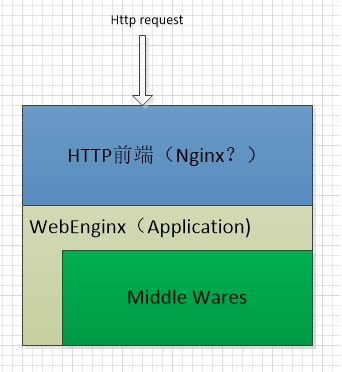

# WebEnginX

 * 一款易于扩展的C++ rest server 后端框架，类似于nodejs中的koa框架。
 * 实现最大程度参考koa框架
 * 前端暂时定位nginx
 * 后端业务使用C++语言实现。
 * 借助variant 实现部分动态特性。
 * 采用Microsoft Concurrency Library （PPL）库简化异步操作

# 开发目标:

 * 易于应用编写，充分利用C++14的特性。
 * 高性能，高并发
 * 易于扩展，简易的中间件开发

# 应用架构



# 参考引用项目
* [koa](https://github.com/koajs/koa)
* [websocketpp](https://github.com/zaphoyd/websocketpp)
* [crow](https://github.com/ipkn/crow)
* [cppcms](https://github.com/artyom-beilis/cppcms)
* [cinatra](https://github.com/topcpporg/cinatra)
* [expresspp](https://github.com/limenghua/expresspp)

# 目标代码示例
```cpp
#include <enginx/enginx.hpp>

int enginx_main(int argc,char ** argv)
{
    auto app = enginx::createApplication();

    auto helloApi = [](enginx::Context & ctx,enginx::NextHandler & next){
        ctx.end("Hello World");
    };

    app->use(helloApi);
    enginx::register(app);
}
```

